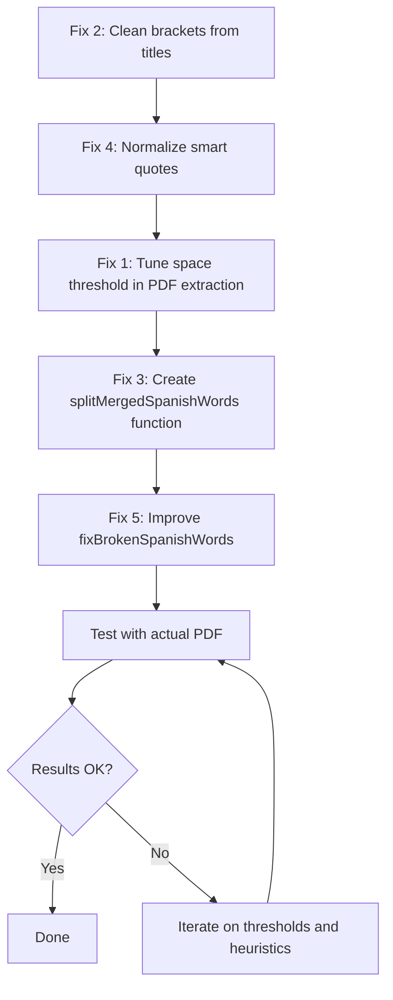

# Plan: Fix PDF Text Extraction Issues

## Problem Summary

The app extracts text from Ken Wapnick PDFs and displays lessons, but several issues cause poor text quality:

1. **Concatenated words** — PDF extraction merges words that should be separated
2. **Bracket references in titles** — `[en esta calle, desde esta ventana, ...]` not removed from lesson titles
3. **No merged-word splitter** — only split-words are fixed, not merged ones
4. **Smart quotes** — typographic quotes not normalized

---

## Root Cause Analysis

### Concatenated Words

The space detection in `buildPageTextFromItems()` at `Home.tsx:59` uses:

```typescript
const spaceThreshold = Math.max(0.35, Math.min(prevCharWidth, currCharWidth) * 0.42);
```

This threshold is too high for some PDF font metrics, causing the function to NOT insert a space when two text items are close but distinct words. Examples from the user:

| Extracted | Should be |
|-----------|-----------|
| verdada | verdad a |
| aplicamosa | aplicamos a |
| bloquesa | bloques a |
| similara | similar a |
| centralo | central o |
| treso | tres o |
| irrealo | irreal o |
| atencióna | atención a |
| aprendera | aprender a |
| renunciara | renunciar a |

All these follow a pattern: **a word glued to a short preposition** - `a`, `o`.

### Brackets in Titles

`cleanTechnicalReferences()` in `lessonExtractor.ts:38` removes `[...]` content but is only applied to `contentText` at line 379 — never to `resolvedTitle` at line 387.

### fixBrokenSpanishWords Only Handles Split Words

The current function at `lessonExtractor.ts:159` re-joins words split by OCR - e.g., `concep ción` to `concepción`. But the inverse - splitting merged words like `verdada` — has no handler.

---

## Proposed Solution

### Fix 1: Tune PDF Space Detection Threshold — `Home.tsx`

**File:** `client/src/pages/Home.tsx` — `buildPageTextFromItems()`

Lower the space threshold multiplier from `0.42` to `0.30` so more inter-word gaps are recognized as spaces:

```typescript
// Before
const spaceThreshold = Math.max(0.35, Math.min(prevCharWidth, currCharWidth) * 0.42);

// After
const spaceThreshold = Math.max(0.25, Math.min(prevCharWidth, currCharWidth) * 0.30);
```

**Risk:** Lowering too much could insert unwanted spaces inside words for some fonts. The post-processing `fixBrokenSpanishWords` should catch these if they occur.

### Fix 2: Apply cleanTechnicalReferences to Lesson Titles — `lessonExtractor.ts`

**File:** `client/src/lib/lessonExtractor.ts` — `extractLessons()`

After line 407, add:

```typescript
resolvedTitle = cleanTechnicalReferences(resolvedTitle);
```

This ensures brackets like `[en esta calle, desde esta ventana, en este lugar]` are removed from titles.

### Fix 3: New `splitMergedSpanishWords()` Function — `lessonExtractor.ts`

**File:** `client/src/lib/lessonExtractor.ts`

Create a new function that detects words merged with common short Spanish prepositions/conjunctions. The pattern is:

- A valid Spanish word root ending + `a`/`o`/`e`/`y` + start of another word
- The merged form doesn not exist as a common word

Strategy: Use a regex-based heuristic that looks for common merge patterns:

```
word + "a" + word  (e.g., verdad+a medida, aplicamos+a nuestra)
word + "o" + word  (e.g., central+o evento, tres+o cuatro)  
word + "e" + word  (less common)
```

Specifically, look for patterns where:
1. A consonant-ending word fragment is followed by `a`/`o` and then a consonant-started word
2. The combined form is NOT a known valid word
3. The fragments would form valid common words when separated

Implementation approach:
- Build a set of known common Spanish words from the text itself using frequency
- For each potential merge point, check if splitting produces two known words
- Use a conservative whitelist of known merge patterns found in this specific use case

### Fix 4: Normalize Smart Quotes — `lessonExtractor.ts`

**File:** `client/src/lib/lessonExtractor.ts` — `cleanTechnicalReferences()` or new utility

Add a `normalizeQuotes()` step that converts:
- `\u201C` and `\u201D` to `"`  
- `\u2018` and `\u2019` to `'`
- Or better: normalize to Spanish-style quotes or keep them consistent

### Fix 5: Improve fixBrokenSpanishWords False Positive Prevention

**File:** `client/src/lib/lessonExtractor.ts` — `fixBrokenSpanishWords()`

Current issue: the function at line 200 only processes lowercase matches, which is good, but the frequency-based approach may not catch all cases. Improvements:

- Expand the `commonStandaloneWords` set with more Spanish words
- Add a check that the joined word appears elsewhere in the text before merging
- Consider using a minimal Spanish dictionary/wordlist for validation

---

## Execution Order



## Files to Modify

| File | Changes |
|------|---------|
| `client/src/pages/Home.tsx` | Lower space detection threshold in `buildPageTextFromItems()` |
| `client/src/lib/lessonExtractor.ts` | Apply `cleanTechnicalReferences` to titles, add `splitMergedSpanishWords()`, add `normalizeQuotes()`, improve `fixBrokenSpanishWords()` |

## Testing Strategy

1. Upload the PDF at `/mnt/c/Users/sergi/Desktop/Libros/KEN/Capitulos del 1 al 20_ KEN/1_al_20.pdf`
2. Navigate to Lesson 4 specifically
3. Verify title shows: `Estos pensamientos no significan nada. Son como las cosas que veo en esta habitación.` — without brackets
4. Verify content has no concatenated words like `verdada`, `aplicamosa`, etc.
5. Verify no new false splits have been introduced
6. Check all other lessons for regressions
